# 🍽️ Restaurant Flutter App

[](https://github.com/ahmedmostafa361/restaurant_flutter_app/actions/workflows/flutter_ci.yml)
[](https://codecov.io/gh/ahmedmostafa361/restaurant_flutter_app)
[](https://flutter.dev)
[](LICENSE)

A Flutter restaurant ordering app built with **Clean Architecture** and **MVVM**, backed by an automated test suite (mappers → data sources → repositories → use cases → view models) and a CI/CD pipeline running on every push.

## 📱 Screenshots

<p align="center">
  
  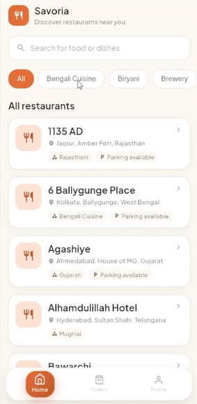
  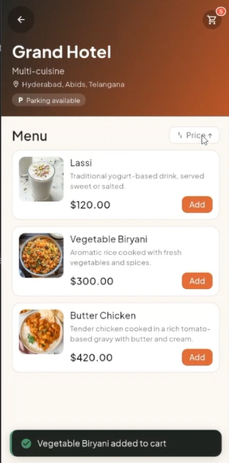
  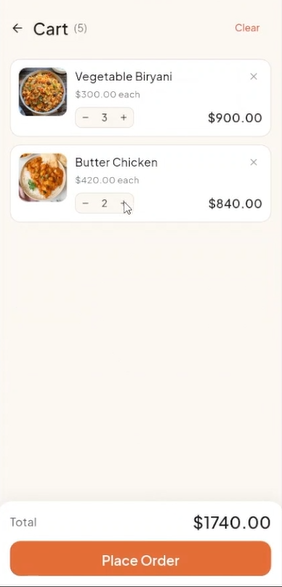
  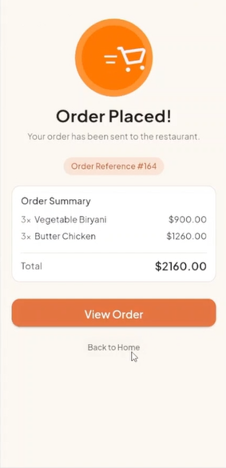
</p>

<details>
<summary><b>📸 See the full app tour (14 screens)</b></summary>
<br>

**Onboarding & Auth**
<p align="center">
  
  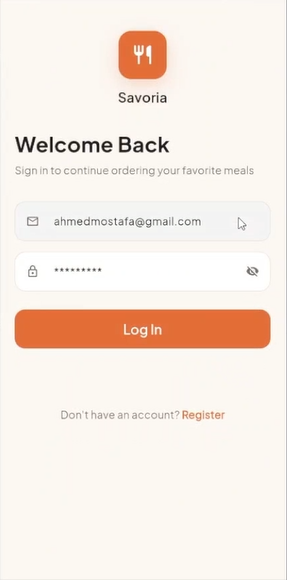
</p>

**Browse & Search**
<p align="center">
  
  
  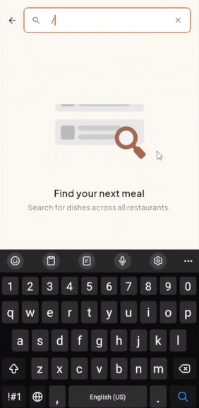
  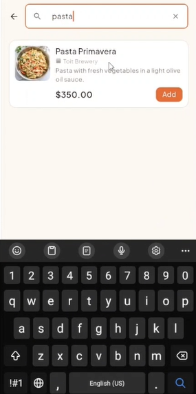
  
</p>

**Cart & Checkout**
<p align="center">
  
  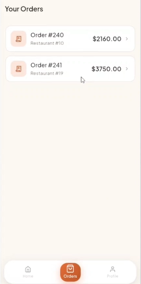
  
  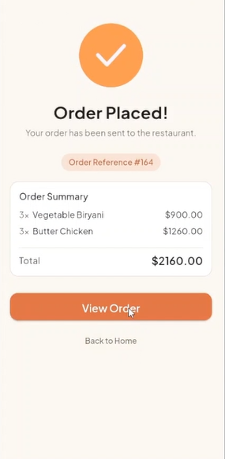
</p>

**Orders & Profile**
<p align="center">
  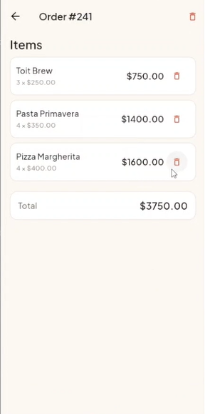
  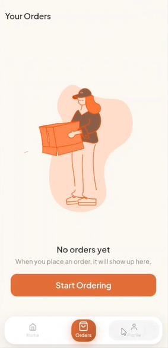
  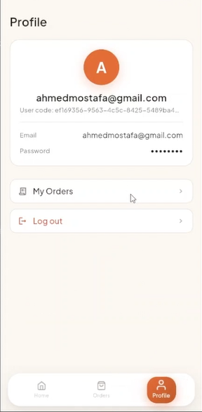
</p>

</details>

<!-- Replace the images above with real screenshots before sharing this repo — create a docs/screenshots/ folder and drop 3-4 PNGs in: home feed, restaurant/menu detail, cart, order history. -->

---

## ✨ Features

- **Browse restaurants** — home feed with categories and search
- **Restaurant details & menu** — view items per restaurant, sort by price
- **Search** — find menu items across restaurants (debounced)
- **Cart** — add, update, and remove items; place order
- **Order history & details** — view past orders, delete single items or a whole order
- **Auth** — login / register flow with secure token storage

---

## 🌐 Backend

The app integrates with the [Fake Restaurant API](https://fakerestaurantapi.runasp.net) — a public mock REST API purpose-built for prototyping food-ordering apps. It provides restaurant/menu browsing, user registration and token-based auth, and full order CRUD (create, list, view details, delete single item or master order). Since it's a shared mock backend, some write operations (e.g. adding a restaurant or menu item) are echoed back but not persisted.

---

## 🏗️ Architecture

The app follows **Clean Architecture** with an **MVVM** presentation layer:

```
UI (Screens)
   ↓ events
Cubit (ViewModel)          — flutter_bloc
   ↓ calls
Use Case                   — domain business logic
   ↓ calls
Repository (interface)     — domain contract
   ↓ implemented by
Repository Impl            — data layer
   ↓ calls
Remote / Local Data Source — dio + retrofit / shared_preferences / secure_storage
   ↓
Mapper (DTO ⇄ Domain Entity)
```

**Why this shape:**
- **`domain/`** has zero Flutter or Dio dependencies — pure Dart entities, repository interfaces, and use cases. This is what makes use cases and view models trivially mockable in tests.
- **`data/`** implements the domain repository interfaces and owns the decision of which data source (remote/local) to hit.
- **`api/`** owns everything Retrofit/Dio-specific: DTOs, generated clients, and the mappers that translate DTOs into domain entities (and back, for requests).
- **`features/ui/`** is organized by screen, each with its own `cubit/` folder holding state + view model — no business logic lives in widgets.

### Project structure

```
lib/
├── api/                  # Dio + Retrofit clients, DTOs, mappers, endpoints
│   ├── data_sources/     # Remote data source implementations
│   ├── mappers/          # DTO ⇄ domain entity mappers, by feature
│   └── model/             # Request/response DTOs (generated + hand-written)
├── config/               # DI setup (get_it + injectable), bloc observer
├── core/                 # Cache/storage, exceptions, app-wide utils/theme
├── data/
│   ├── data_sources/     # Abstract data source contracts
│   └── repository/       # Repository implementations
├── domain/
│   ├── entinties/        # Domain entities (request/response)
│   ├── repository/       # Repository interfaces
│   └── use_cases/        # One class per business action
├── features/ui/          # Screens, grouped by feature, each with cubit/ + widget/
└── widget/                # Shared/reusable widgets
```

---

## 🧪 Testing

The project is tested layer by layer, mirroring the architecture above, using **Mocktail** for boundary mocking and **bloc_test** for cubit state assertions.

| Layer | What's tested | Tooling |
|---|---|---|
| Mappers | DTO ⇄ domain field mapping, null/edge cases | `flutter_test` (pure, no mocks needed) |
| Interceptors | DioException → domain exception translation (network/server/unexpected) | `flutter_test` (capturing `ErrorInterceptorHandler`) |
| Remote data sources | Correct API calls, response handling | `mocktail` (mocking `Dio`/`ApiServices`) |
| Repositories | Delegation to data sources, error propagation | `mocktail` |
| Use cases | Business logic in isolation from repositories | `mocktail` |
| Cubits (ViewModels) | State transitions (loading → success/error), validation, debounced search | `bloc_test` + `mocktail` |

**On the coverage badge:** it reports coverage for `api/`, `data/`, and `domain/` only — generated code (`*.g.dart`, `di.config.dart`, `gen/`), `main.dart`, and `features/ui/` are excluded from the metric (see CI config below). Cubits under `features/ui/**/cubit/` *are* tested with `bloc_test`, but since they live under `features/ui/`, they're filtered out of the coverage number too — the badge reflects business-logic coverage specifically, not overall test count.

Run the full suite locally:

```bash
flutter test
```

With coverage:

```bash
flutter test --coverage
genhtml coverage/lcov.info -o coverage/html   # requires lcov
```

---

## ⚠️ Known Limitations

- **Error type granularity is partially lost at the data source layer.** `DioInterceptors` correctly builds three distinct exception types (`NetworkErrorException`, `ServerErrorException`, `UnExpectedErrorException`) based on the failure mode, but the current remote data source implementations catch `DioException` and always rethrow as `ServerErrorException`, discarding that distinction before it reaches the UI. This is covered and documented by a dedicated test in the suite; fixing it (rethrowing `e.error` directly) is a planned follow-up.
- **The backend is a shared public mock API**, so some write endpoints (adding restaurants/menu items) don't persist between requests — this is a constraint of the API, not the app.
- **UI/widget tests are intentionally out of scope** for this project's test suite — the focus was on proving out the business logic layer (mappers → data sources → repositories → use cases → view models) rather than pixel-level UI verification.

---

## 🛠️ Tech Stack

| Category | Packages |
|---|---|
| State management | `flutter_bloc` (Cubit) |
| Networking | `dio`, `retrofit`, `pretty_dio_logger` |
| Dependency injection | `get_it`, `injectable` |
| Local storage | `shared_preferences`, `flutter_secure_storage` |
| Serialization / codegen | `json_annotation` + `json_serializable`, `build_runner` |
| UI | `google_fonts`, `flutter_screenutil`, `cached_network_image`, `shimmer`, `skeletonizer`, `flutter_animate`, `lottie`, `flutter_image_slideshow`, `animated_bottom_navigation_bar`, `readmore` |
| Testing | `mocktail`, `bloc_test`, `flutter_test` |
| CI / Coverage | GitHub Actions, Codecov |

---

## 🚀 Getting Started

### Prerequisites

- Flutter `3.35.7` (stable channel) — matches the version pinned in CI; the project targets Dart SDK `^3.9.0`
- Dart (bundled with Flutter)

### Setup

```bash
# 1. Clone the repo
git clone https://github.com/ahmedmostafa361/restaurant_flutter_app.git
cd restaurant_flutter_app

# 2. Install dependencies
flutter pub get

# 3. Generate code (Retrofit clients, DTO fromJson/toJson, injectable DI graph)
flutter pub run build_runner build --delete-conflicting-outputs

# 4. Run the app
flutter run
```

### Running tests

```bash
flutter test
```

---

## 🔄 CI/CD

Every push and pull request to `master` triggers a GitHub Actions workflow ([`flutter_ci.yml`](.github/workflows/flutter_ci.yml)) that:

1. Checks out the code and sets up Flutter `3.35.7` (stable)
2. Installs dependencies (`flutter pub get`)
3. Runs code generation (`dart run build_runner build --delete-conflicting-outputs`)
4. Runs the full test suite with coverage (`flutter test --coverage`)
5. **Filters the coverage report** with [`remove_from_coverage`](https://pub.dev/packages/remove_from_coverage), stripping out:
   - generated files (`*.g.dart`)
   - the DI graph (`di.config.dart`)
   - the UI layer (`features/ui/`)
   - `main.dart`
   - generated assets (`gen/`)
6. Uploads the filtered report to [Codecov](https://codecov.io/gh/ahmedmostafa361/restaurant_flutter_app) (non-blocking — `fail_ci_if_error: false`)

This keeps the coverage number honest: it measures how well the actual business logic (mappers, data sources, repositories, use cases) is tested, rather than being inflated or diluted by generated boilerplate.

---

## 📄 License

This project is licensed under the MIT License — see the [LICENSE](LICENSE) file for details.

---

## 👤 Contact

**Ahmed Mostafa Megahed**
Flutter Developer | BLoC & Clean Architecture

- GitHub: [@ahmedmostafa361](https://github.com/ahmedmostafa361)
- LinkedIn: [ahmed-mostafa-041690375](https://linkedin.com/in/ahmed-mostafa-041690375)
- TikTok: [@fixha_tech](https://www.tiktok.com/@fixha_tech)

